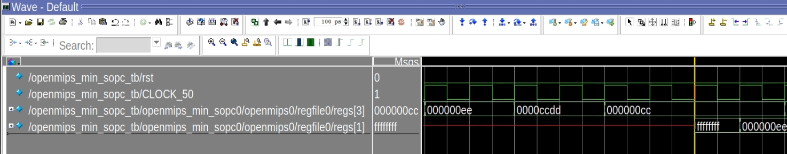
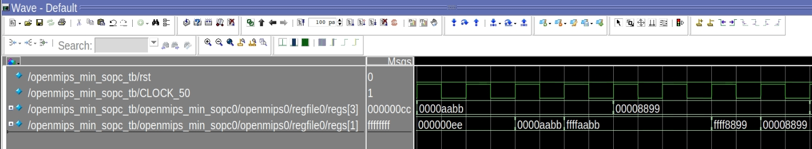
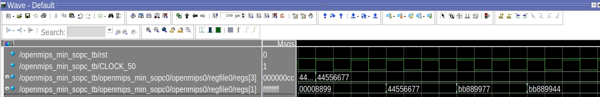
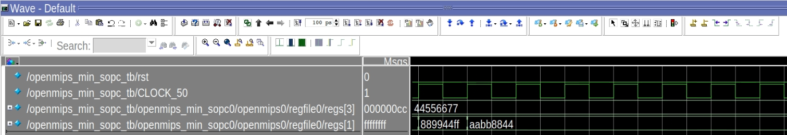

<center>
    <h1 align="center">OpenMIPS CPU</h1>
    <h4 align="center">Implement load and store operation</strong> </h4>
    <p align="center">
        <strong>Last updated:</strong> 30 Sep 2024<br>
    </p> 
</center>

# Results
This part implements 7 load and 5 store operation instructions.

### Instruction

The following instructions are to be implemented
* lb、lbu、lh、lhu、lw、lwl、lwr
* sb、sh、sw、swl、swr
```
_start:
    ##sb、lb、lbu##
    
    ori $3, $0, 0xeeff
    sb  $3, 0x3 ($0)

    srl $3, $3, 8
    sb  $3, 0x2 ($0)

    ori $3, $0, 0xccdd
    sb  $3, 0x1 ($0)

    srl $3, $3, 8
    sb  $3, 0x0 ($0)

    lb  $1, 0x3 ($0)
    lbu $1, 0x2 ($0)

    ##sh、lh、lhu##

    ori $3, $0, 0xaabb
    sh  $3, 0x4 ($0)

    lhu $1, 0x4 ($0)
    lh  $1, 0x4 ($0)

    ori $3, $0, 0x8899
    sh  $3, 0x6 ($0)

    lh  $1, 0x6 ($0)
    lhu $1, 0x6 ($0)

    ##sw、lw、lwl、lwr##

    ori $3, $0, 0x4455
    sll $3, $3, 0x10
    ori $3, $3, 0x6677
    sw  $3, 0x8 ($0)

    lw  $1, 0x8 ($0)

    lwl $1, 0x5 ($0)

    lwr $1, 0x8 ($0)

    nop

    ##swl、swr##

    swr $1, 0x2 ($0)

    swl $1, 0x7 ($0)

    lw  $1, 0x0 ($0)

    lw  $1, 0x4 ($0)

_loop:
    j _loop
    nop
```

### Waveform
* lb、lbu、lh、lhu、lw、lwl、lwr、sb、sh、sw、swl、swr






# References
* [自己動手寫CPU](https://www.books.com.tw/products/0010676982)