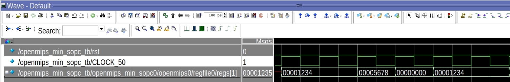
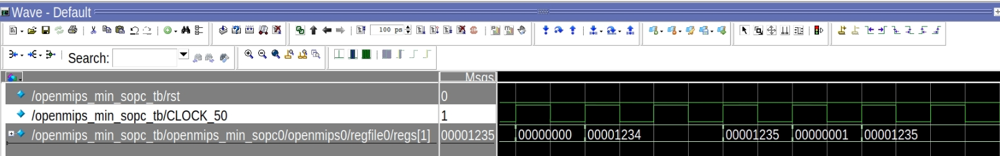

<center>
    <h1 align="center">OpenMIPS CPU</h1>
    <h4 align="center">Implement load and store operation part 2</strong> </h4>
    <p align="center">
        <strong>Last updated:</strong> 01 Oct 2024<br>
    </p> 
</center>

# Results
This part implements 1 load and 1 store operation instructions.

### Instruction

The following instructions are to be implemented
* ll、sc
```
_start:
    ## without ll run sc ##
    ori $1, $0, 0x1234
    sw  $1, 0x0 ($0)

    ori $1, $0, 0x5678
    sc  $1, 0x0 ($0)

    lw  $1, 0x0 ($0)

    nop

    ## Read-Modify-Write ##
    ori $1, $0, 0x0
    ll  $1, 0x0 ($0)

    nop
    addi $1, $1, 0x1
    sc   $1, 0x0 ($0)

    lw   $1, 0x0 ($0)

_loop:
    j _loop
    nop
```

* load dependency
```
_start:
    ori $1, $0, 0x1234
    sw  $1, 0x0 ($0)

    ori $2, $0, 0x1234
    ori $1, $0, 0x0

    lw  $1, 0x0 ($0)

    beq $1, $2, Label
    nop

    ori $1, $0, 0x4567
    nop

Label:
    ori $1, $0, 0x89ab
    nop

_loop:
    j _loop
    nop
```

### Waveform
* ll、sc




* load dependency


# References
* [自己動手寫CPU](https://www.books.com.tw/products/0010676982)