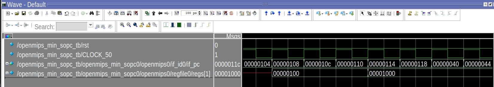

<center>
    <h1 align="center">OpenMIPS CPU</h1>
    <h4 align="center">Implement exception handlers and interrupt handlers</strong> </h4>
    <p align="center">
        <strong>Last updated:</strong> 04 Oct 2024<br>
    </p> 
</center>

# Results
This part implements interrupt、trap、system call operation instructions.

### Instruction

The following instructions are to be implemented
* Interrupt
```
_start:
   ori $1,$0,0x100     # $1 = 0x100
   jr $1
   nop

   .org 0x20
   addi $2,$2,0x1
   mfc0 $1,$11,0x0
   addi $1,$1,100
   mtc0 $1,$11,0x0
   eret
   nop

   .org 0x100
   ori $2,$0,0x0
   ori $1,$0,100
   mtc0 $1,$11,0x0  
   lui $1,0x1000
   ori $1,$1,0x401
   mtc0 $1,$12,0x0
  

_loop:
   j _loop
   nop
```

* Syscall
```
_start:
    #因為低位址有異常處理常式，所以處理器啟動後，就立刻轉移到0x100
    ori $1, $0, 0x100
    jr  $1
nop

    #系統呼叫異常處理常式
    .org 0x40
    ori  $1, $0, 0x8000
    ori  $1, $0, 0x9000
    mfc0 $1, $14, 0x0
    addi $1, $1, 0x4
    mtc0 $1, $14, 0x0
    eret
    nop

    #main function， 呼叫syscall，從而引起系統呼叫異常
    .org 0x100
    ori $1, $0, 0x1000
    sw  $1, 0x0100 ($0)

    mthi $1
    
    syscall

    lw $1, 0x0100 ($0)

    mfhi $2

_loop:
    j _loop
    nop
```

* Trap
```
_start:
   ori $1,$0,0x100     # $1 = 0x100
   jr $1
   nop

   .org 0x40
   ori $1,$0,0xf0f0    # $1 = 0x0000f0f0
   ori $1,$0,0xffff    # $1 = 0x0000ffff
   ori $1,$0,0x0f0f    # $1 = 0x00000f0f
   mfc0 $4,$14,0x0     
   addi $4,$4,0x4      
   mtc0 $4,$14,0x0
   eret
   nop

   .org 0x100
   ori $1,$0,0x1000    # $1 = 0x00001000
   ori $2,$0,0x1000    # $2 = 0x00001000
   teq $1,$2           # trap happen
   ori $1,$0,0x2000    # $1 = 0x00002000
   tne $1,$2           # trap happen
   ori $1,$0,0x3000    # $1 = 0x00003000
   teqi $1,0x3000      # trap happen
   ori $1,$0,0x4000    # $1 = 0x00004000
   tnei $1,0x2000      # trap happen
   ori $1,$0,0x5000    # $1 = 0x00005000
   tge $1,$2           # trap happen
   ori $1,$0,0x6000    # $1 = 0x00006000
   tgei $1,0x4000      # trap happen
   ori $1,$0,0x7000    # $1 = 0x00007000
   tgeiu $1,0x7000     # trap happen
   ori $1,$0,0x8000    # $1 = 0x00008000
   tgeu $1,$2          # trap happen
   ori $1,$0,0x9000    # $1 = 0x00009000
   tlt $1,$2           # not trap
   ori $1,$0,0xa000    # $1 = 0x0000a000
   tlti $1,0x9000      # not trap
   ori $1,$0,0xb000    # $1 = 0x0000b000
   tltiu $1,0xb000     # trap happen ecause $1=0xb000 < 0xffffb000
   ori $1,$0,0xc000    # $1 = 0x0000c000
   tltu $2,$1          # trap happen
   ori $1,$0,0xd000    # $1 = 0x0000d000
_loop:
   j _loop
   nop
```

### Waveform
* Interrupt


* Syscall




* Trap


# References
* [自己動手寫CPU](https://www.books.com.tw/products/0010676982)