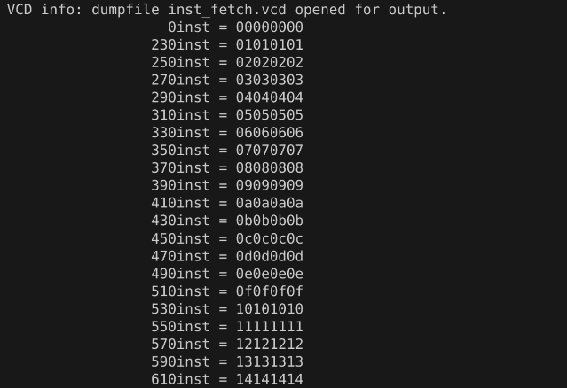
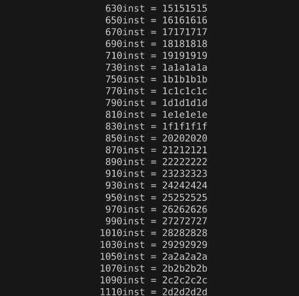
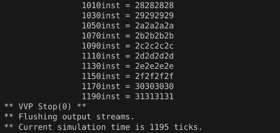
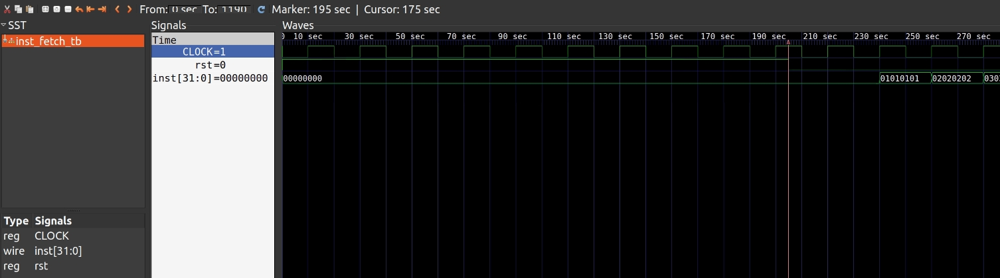
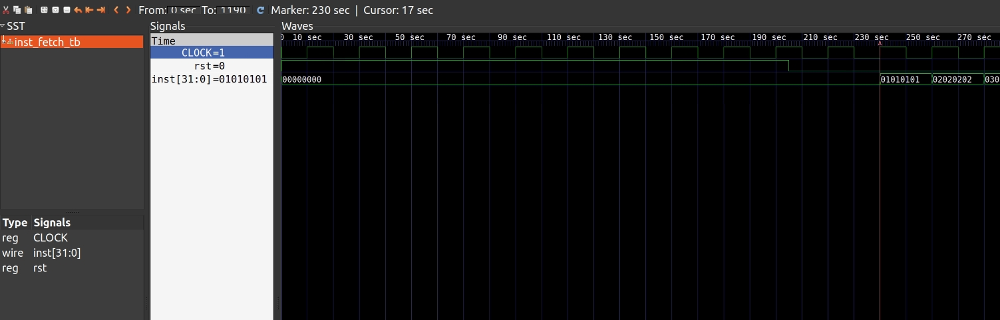
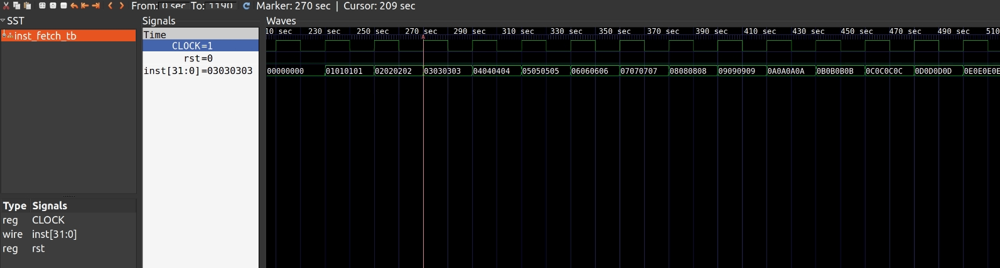
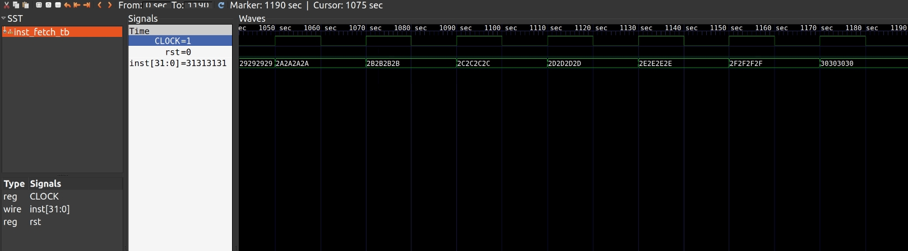

    <h1 align="center">Program Counter(PC)</h1>
    <h4 align="center">Simulate PC reading rom data</strong> </h4>
    

        <strong>Last updated:</strong> 10 Sep 2024 
    
 

# Results
I used Iverilog to complete this exercise and simulated it on GTKWave.

* VCD

* GTKWave

# About
PC is the first and essential part of the CPU. This exercise helped me understand computer architecture better.