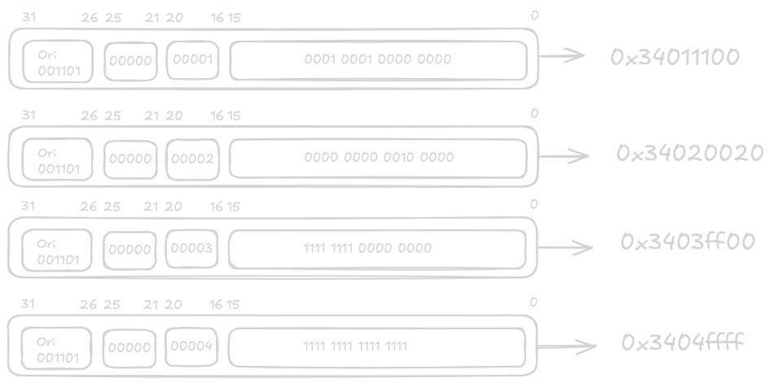
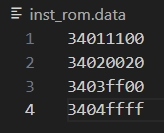
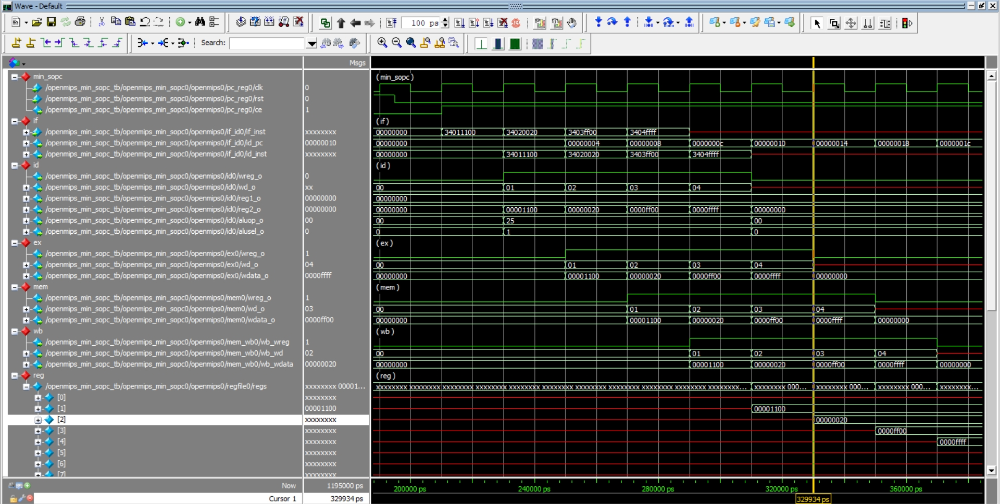

<center>
    <h1 align="center">OpenMIPS CPU</h1>
    <h4 align="center">Implementation of the ori instruction</strong> </h4>
    <p align="center">
        <strong>Last updated:</strong> 14 Sep 2024<br>
    </p> 
</center>

# Results
I implemented a 5-stage pipeline and showed how each stage works using the ori instruction.

### Instruction

The following 4 instructions are to be implemented
```
ori $1, $0, 0x1100
ori $2, $0, 0x0020
ori $3, $0, 0xff00
ori $4, $0, 0xffff
```




### Waveform



# References
* [自己動手寫CPU](https://www.books.com.tw/products/0010676982)
* [Excalidraw](https://excalidraw.com/)