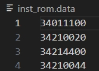
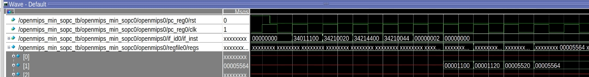

<center>
    <h1 align="center">OpenMIPS CPU</h1>
    <h4 align="center">Use ori instruction to implement <br>Read After Write(RAW) hazard</strong> </h4>
    <p align="center">
        <strong>Last updated:</strong> 16 Sep 2024<br>
    </p> 
</center>

# Results
This part solves the RAW situation of data dependency.

Use Forwarding Data to send EXE and MEM results back to ID.

### Instruction

The following 4 instructions are to be implemented
```
ori $1, $0, 0x1100
ori $1, $1, 0x0020
ori $1, $1, 0x4400
ori $1, $1, 0x0044
```



### Waveform



# References
* [自己動手寫CPU](https://www.books.com.tw/products/0010676982)
* [Excalidraw](https://excalidraw.com/)