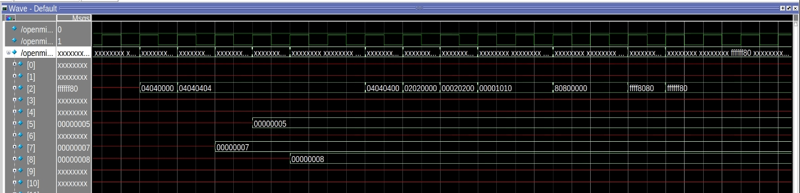

<center>
    <h1 align="center">OpenMIPS CPU</h1>
    <h4 align="center">Implement logical、shift operation & NOP</strong> </h4>
    <p align="center">
        <strong>Last updated:</strong> 20 Sep 2024<br>
    </p> 
</center>

# Results
This part implements 8 logical operation instructions and 6 shift operation instructions, and treats the sync instruction as a nop instruction.

!! The pref instruction is used for cache prefetching, but OpenMIPS does not implement cache.

### Instruction

The following instructions are to be implemented
* Logic
```
lui  $1, 0x0101
ori  $1, $1, 0x0101
ori  $2, $1, 0x1100
or   $1, $1, $2
andi $3, $1, 0x00fe
and  $1, $3, $1
xori $4, $1, 0xff00
xor  $1, $4, $1
nor  $1, $4, $1
```
* Shift
```
lui  $2, 0x0404
ori  $2, $2, 0x0404
ori  $7, $0, 0x7
ori  $5, $0, 0x5
ori  $8, $0, 0x8
sync
sll  $2, $2, 8
sllv $2, $2, $7
srl  $2, $2, 8
srlv $2, $2, $5
nop
sll  $2, $2, 19
ssnop
sra  $2, $2, 16
srav $2, $2, $8
```

### Waveform
* Logic

* Shift


# References
* [自己動手寫CPU](https://www.books.com.tw/products/0010676982)