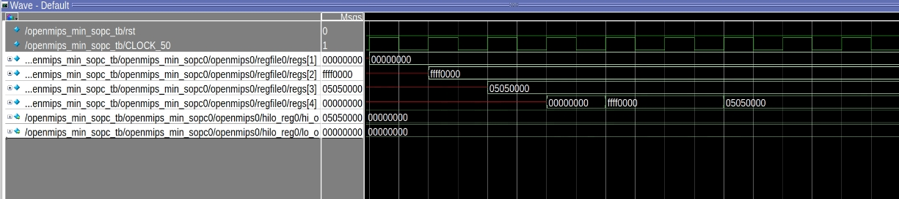
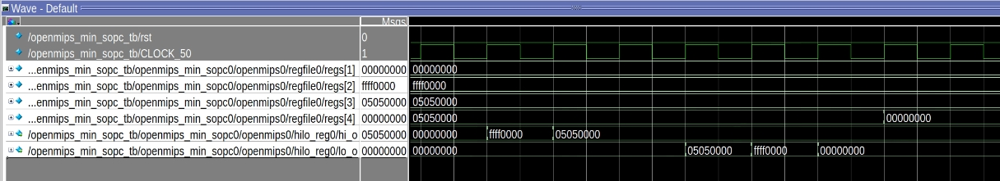

<center>
    <h1 align="center">OpenMIPS CPU</h1>
    <h4 align="center">Implement move operation</strong> </h4>
    <p align="center">
        <strong>Last updated:</strong> 22 Sep 2024<br>
    </p> 
</center>

# Results
This part implements 6 move operation instructions.

### Instruction

The following instructions are to be implemented
* Logic
```
lui $1, 0x0000
lui $2, 0xffff
lui $3, 0x0505
lui $4, 0x0000

movz $4, $2, $1
movn $4, $3, $1
movn $4, $3, $2
movz $4, $2, $3

mthi $0
mthi $2
mthi $3

mfhi $4

mtlo $3
mtlo $2
mtlo $1

mflo $4
```

### Waveform
* Move instruction

* Access HILO


# References
* [自己動手寫CPU](https://www.books.com.tw/products/0010676982)