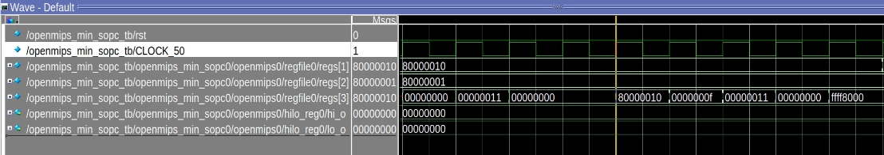
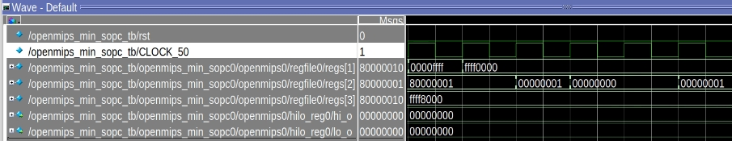
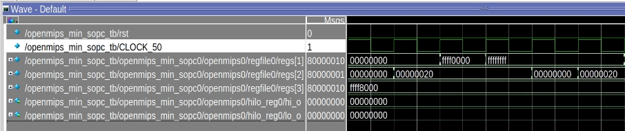
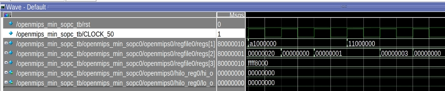
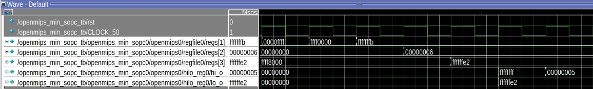

<center>
    <h1 align="center">OpenMIPS CPU</h1>
    <h4 align="center">Implement basic arithmetic operation</strong> </h4>
    <p align="center">
        <strong>Last updated:</strong> 23 Sep 2024<br>
    </p> 
</center>

# Results
This part implements 15 arithmetic operation instructions.

### Instruction

The following instructions are to be implemented
* add、addi、addiu、addu、sub、subu
```
ori  $1, $0, 0x8000
sll  $1, $1, 16
ori  $1, $1, 0x0010

ori  $2, $0, 0x8000
sll  $2, $2, 16
ori  $2, $2, 0x0001

ori  $3, $0, 0x0000
addu $3, $2, $1
ori  $3, $0, 0x0000
add  $3, $2, $1

sub   $3, $1, $3
subu  $3, $3, $2

addi  $3, $3, 2
ori   $3, $0, 0x0000
addiu $3, $3, 0x8000
```
* slt、sltu、slti、sltiu
```
or    $1, $0, 0xffff
sll   $1, $1, 16
slt   $2, $1, $0
sltu  $2, $1, $0
slti  $2, $1, 0x8000
sltiu $2, $1, 0x8000
```
* clo、clz
```
lui $1, 0x0000
clo $2, $1
clz $2, $1

lui $1, 0xffff
ori $1, $1, 0xffff
clz $2, $1
clo $2, $1

lui $1, 0xa100
clz $2, $1
clo $2, $1

lui $1, 0x1100
clz $2, $1
clo $2, $1
```
* mul、mult、multu
```
ori   $1, $0, 0xffff
sll   $1, $1, 16
ori   $1, $1, 0xfffb
ori   $2, $0, 6
mul   $3, $1, $2 # $1*$2 (sign) low 32 bit to $3

mult  $1, $2 # HI=0xffffffff、LO=0xffffffe2

multu $1, $2 # HI=0x5、LO=0xffffffe2
```

### Waveform
* add、addi、addiu、addu、sub、subu

* slt、sltu、slti、sltiu

* clz、clo


* mul、mult、multu


# References
* [自己動手寫CPU](https://www.books.com.tw/products/0010676982)