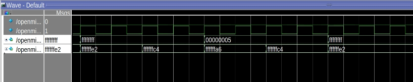

<center>
    <h1 align="center">OpenMIPS CPU</h1>
    <h4 align="center">Implement stall/madd/msub operation</strong> </h4>
    <p align="center">
        <strong>Last updated:</strong> 27 Sep 2024<br>
    </p> 
</center>

# Results
This part implements 4 arithmetic operation instructions and pipeline stall to accomplish madd (multiply-add) msub (multiply-subtract) which requires two clock cycles.

### Instruction

The following instructions are to be implemented
* madd、maddu、msub、msubu
```
ori $1, $0, 0xffff
sll $1, $1, 16
ori $1, $1, 0xfffb
ori $2, $0, 6

mult $1, $2

madd $1, $2

maddu $1, $2

msub $1, $2

msubu $1, $2
```


### Waveform
* add、addi、addiu、addu、sub、subu


# References
* [自己動手寫CPU](https://www.books.com.tw/products/0010676982)