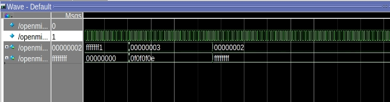

<center>
    <h1 align="center">OpenMIPS CPU</h1>
    <h4 align="center">Implement division operation</strong> </h4>
    <p align="center">
        <strong>Last updated:</strong> 28 Sep 2024<br>
    </p> 
</center>

# Results
This part implements 2 division operation instructions.

### Instruction

The following instructions are to be implemented
* div、divu
```
ori $2, $0, 0xffff
sll $2, $2, 16
ori $2, $2, 0xfff1
ori $3, $0, 0x11

div $zero, $2, $3

divu $zero, $2, $3

div $zero, $3, $2
```

### Waveform
* add、addi、addiu、addu、sub、subu


# References
* [自己動手寫CPU](https://www.books.com.tw/products/0010676982)