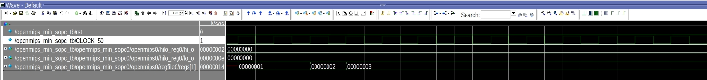
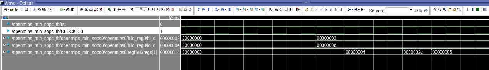
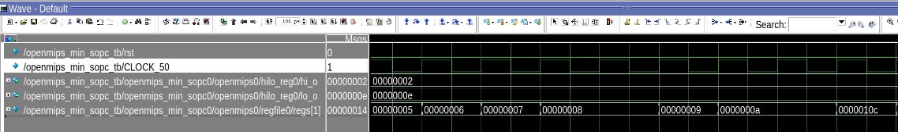
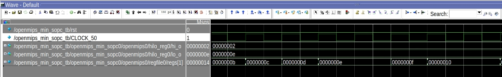
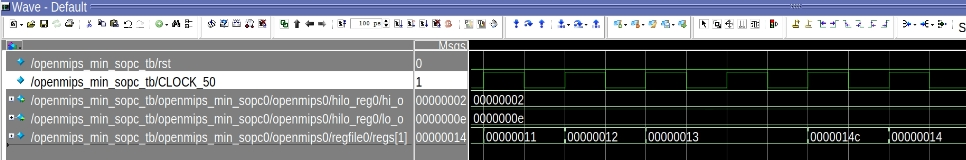
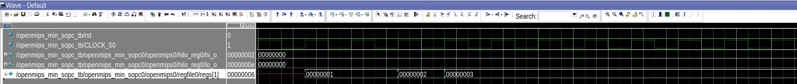
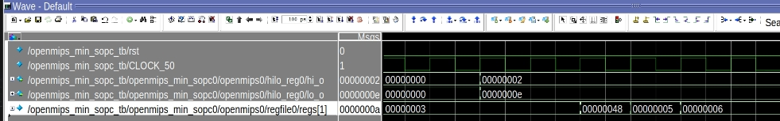
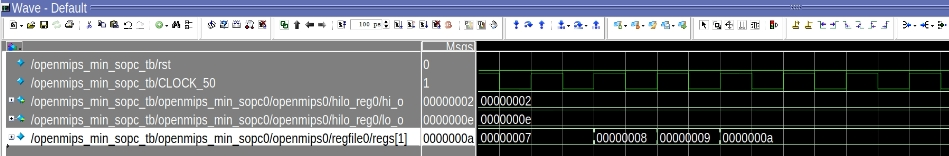

<center>
    <h1 align="center">OpenMIPS CPU</h1>
    <h4 align="center">Implement jumps and branches operation</strong> </h4>
    <p align="center">
        <strong>Last updated:</strong> 29 Sep 2024<br>
    </p> 
</center>

# Results
This part implements 4 jumps and 10 branches operation instructions.

### Instruction

The following instructions are to be implemented
* b、bal、beq、bgez、bgezal、bgtz、blez、bltz、bltzal、bne
```
_start:
    ori $3, $0, 0x8000
    sll $3, 16
    ori $1, $0, 0x0001
    b   s1
    ori $1, $0, 0x0002
1:
    ori $1, $0, 0x1111
    ori $1, $0, 0x1100
    
    .org 0x20
s1:
    ori $1, $0, 0x0003
    bal s2
    div $zero, $31, $1

    ori $1, $0, 0x1100
    ori $1, $0, 0x1111
    bne $1, $0, s3
    nop
    ori $1, $0, 0x1100
    ori $1, $0, 0x1111
    
    .org 0x50
s2:
    ori $1, $0, 0x0004
    beq $3, $3,  s3
    or  $1, $31, $0
    ori $1, $0, 0x1111
    ori $1, $0, 0x1100
2:
    ori $1, $0, 0x0007
    ori $1, $0, 0x0008
    bgtz $1, s4
    ori $1, $0, 0x0009
    ori $1, $0, 0x1111
    ori $1, $0, 0x1100

    .org 0x80
s3:
    ori  $1, $0, 0x0005
    bgez $1, 2b
    ori $1, $0, 0x0006
    ori $1, $0, 0x1111
    ori $1, $0, 0x1100
    
    .org 0x100
s4:
    ori    $1, $0, 0x000a
    bgezal $3, s3
    or     $1, $0, $31
    ori  $1, $0, 0x000b
    ori  $1, $0, 0x000c
    ori  $1, $0, 0x000d
    ori  $1, $0, 0x000e
    bltz $3, s5
    ori  $1, $0, 0x000f
    ori  $1, $0, 0x1100

    .org 0x130
s5:
    ori  $1, $0, 0x0010
    blez $1, 2b
    ori $1, $0, 0x0011
    ori $1, $0, 0x0012
    ori $1, $0, 0x0013
    bltzal $3, s6
    or  $1, $0, $31
    ori $1, $0, 0x1100

    .org 0x160
s6:
    ori $1, $0, 0x0014
    nop
_loop:
    j _loop
    nop
```

* jr、jalr、j、jal
```
_start:
    ori $1, $0, 0x0001
    j   0x20
    ori $1, $0, 0x0002
    ori $1, $0, 0x1111
    ori $1, $0, 0x1100

    .org 0x20
    ori $1, $0, 0x0003
    jal 0x40
    div $zero, $31, $1

    ori $1, $0, 0x0005
    ori $1, $0, 0x0006
    j   0x60
    nop

    .org 0x40
    jalr $2, $31
    or $1, $2, $0

    ori $1, $0, 0x0009
    ori $1, $0, 0x000a
    j 0x80
    nop

    .org 0x60
    ori $1, $0, 0x0007
    jr $2
    ori $1, $0, 0x0008
    ori $1, $0, 0x1111
    ori $1, $0, 0x1100

    .org 0x80
    nop

_loop:
    j _loop
    nop
```

### Waveform
* b、bal、beq、bgez、bgezal、bgtz、blez、bltz、bltzal、bne







* jr、jalr、j、jal




# References
* [自己動手寫CPU](https://www.books.com.tw/products/0010676982)